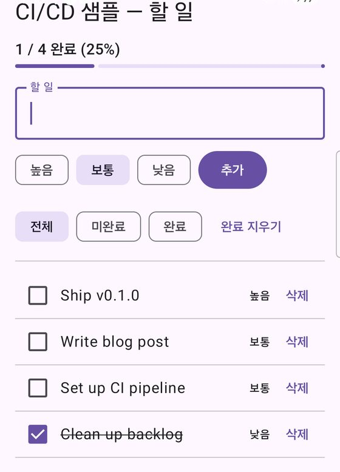
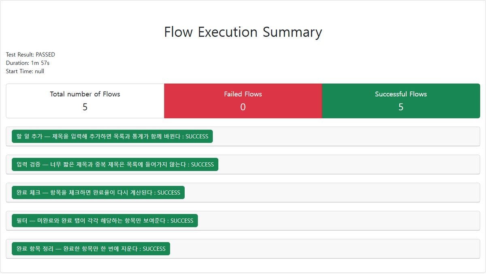
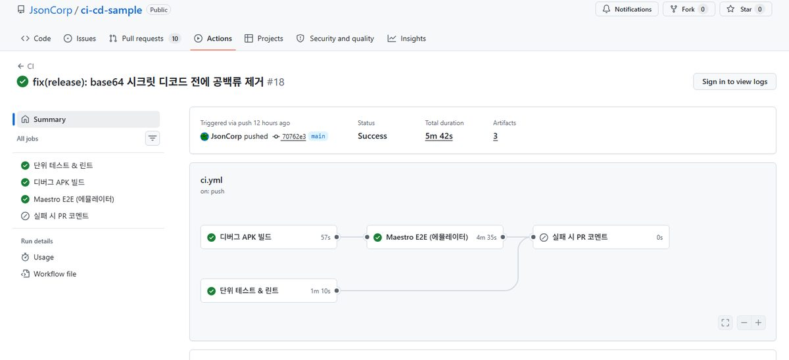
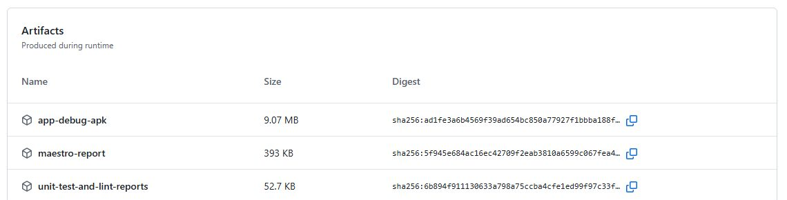
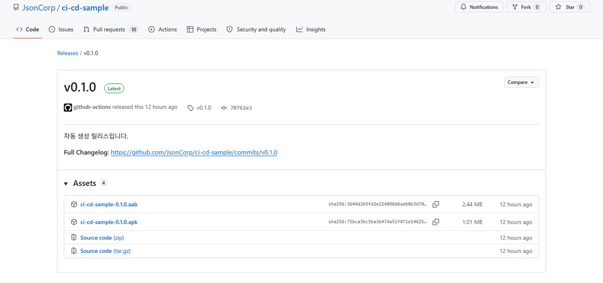
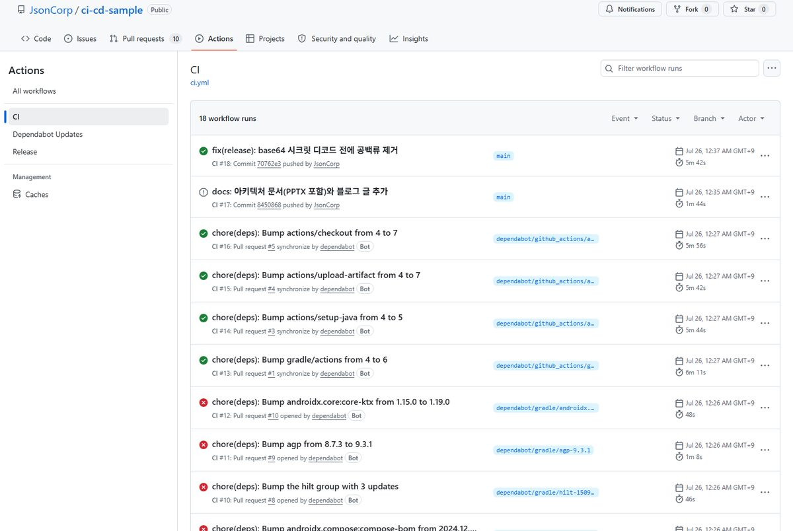

# 테스트 가능한 구조가 먼저다 — 안드로이드 3계층 앱에 CI/CD 붙이기

> 워크플로 YAML 을 붙이기 전에 앱 구조부터 손봐야 했던 이야기입니다.
> 3계층 분리 → 3단 테스트 → CI 잡 분할 → 태그 기반 서명 릴리스 순으로 갑니다.
> 예제는 공개 저장소 [**ci-cd-sample**](https://github.com/JsonCorp/ci-cd-sample) 에서 실제로 도는 파이프라인입니다.

---

## 1. 워크플로부터 붙였더니 검증할 게 없었다

CI 를 처음 붙일 때 저는 순서를 거꾸로 밟았습니다. 워크플로 파일부터 만들고,
`./gradlew build` 를 넣고, 초록불이 뜨는 걸 보고 만족했습니다.

그런데 며칠 지나서 이런 일이 생깁니다.

- 완료율 계산에서 **0으로 나누는 버그**를 넣었는데 CI 는 초록이었습니다. 테스트가 없으니까요.
- 목록 정렬 순서를 바꿨는데 아무도 몰랐습니다. 화면을 직접 열어봐야 알 수 있었습니다.
- "테스트를 추가하자"고 마음먹고 코드를 열었더니, **테스트를 쓸 수 있는 자리가 없었습니다.**
  계산 로직이 Composable 안에 있었고, 저장소를 만드는 코드가 ViewModel 생성자 안에 박혀 있었습니다.

CI 가 하는 일은 "내가 시킨 검증을 대신 돌려주는 것"입니다. 시킬 검증이 없으면
**CI 는 컴파일 체크 이상이 되지 못합니다.** 워크플로 YAML 을 아무리 잘 써도 이건 해결되지 않습니다.

그래서 이번에는 순서를 바꿔서, **검증할 수 있는 구조를 먼저 만들고** 그 위에 파이프라인을 얹었습니다.
이 글은 그 과정과 실제로 밟은 함정들의 기록입니다.

만들어진 결과는 이렇습니다.

| 층 | 무엇을 검증하나 | 개수 | 어디서 도나 |
|---|---|---:|---|
| 단위 테스트 | 검증·정렬·집계 규칙, 상태 조립 | 44 | JVM (에뮬레이터 불필요) |
| Compose UI 테스트 | 렌더링, 콜백 배선 | 8 | 에뮬레이터 |
| Maestro E2E | 실제 앱 전체 흐름 | 5 | 에뮬레이터 |

샘플 앱은 이렇게 생겼습니다. 화면은 하나뿐이지만, 뒤에 있는 규칙은 전부 테스트로 덮여 있습니다.



---

## 2. 공식 3계층으로 앱 다시 짜기

안드로이드 공식 가이드가 권하는 구조는 세 계층입니다.

```
UI 계층      화면과 화면 상태
   ↓
도메인 계층   비즈니스 규칙 (선택이지만, 이 글에서는 필수)
   ↓
데이터 계층   저장소와 데이터 소스
```

샘플 앱은 할 일 관리 앱입니다. 카운터 같은 앱으로는 단위 테스트가 형식적이 되기 때문에,
**분기가 있는 규칙**을 일부러 넣었습니다.

- 제목 검증 — 공백 / 2자 미만 / 40자 초과 / 중복이면 거부
- 정렬 — 미완료 먼저 → 우선순위 높은 순 → 먼저 등록한 순
- 통계 — 완료율 반올림, 전체가 0건이면 0으로 나누지 않음

### 2-1. 도메인 계층 — 규칙이 모이는 곳

도메인 계층에는 모델, 저장소 **인터페이스**, 유스케이스가 들어갑니다.

```kotlin
// domain/model/Task.kt
data class Task(
    val id: Long,
    val title: String,
    val priority: Priority,
    val done: Boolean,
    val order: Int,
)

enum class Priority { LOW, NORMAL, HIGH }   // ordinal 이 클수록 급한 일
```

중요한 건 **저장소 인터페이스를 도메인이 소유한다**는 점입니다.

```kotlin
// domain/repository/TaskRepository.kt
interface TaskRepository {
    fun observeTasks(): Flow<List<Task>>
    suspend fun addTask(title: String, priority: Priority): Task
    suspend fun setDone(id: Long, done: Boolean): Boolean
    suspend fun deleteTask(id: Long): Boolean
    suspend fun deleteCompleted(): Int
}
```

구현은 데이터 계층에 있지만, **화살표는 데이터 → 도메인 방향**입니다.
도메인은 저장 방식이 메모리인지 Room 인지 네트워크인지 모릅니다. 이게 의존성 역전이고,
테스트에서 페이크를 꽂을 수 있는 이유입니다.

유스케이스는 규칙 하나를 담는 작은 클래스입니다.

```kotlin
// domain/usecase/AddTaskUseCase.kt
class AddTaskUseCase @Inject constructor(
    private val repository: TaskRepository,
) {
    suspend operator fun invoke(rawTitle: String, priority: Priority = Priority.NORMAL): Result<Task> {
        val title = rawTitle.trim()

        if (title.isEmpty()) return failure(TitleError.BLANK)
        if (title.length < MIN_TITLE_LENGTH) return failure(TitleError.TOO_SHORT)
        if (title.length > MAX_TITLE_LENGTH) return failure(TitleError.TOO_LONG)

        val existing = repository.observeTasks().first()
        if (existing.any { it.title.normalize() == title.normalize() }) {
            return failure(TitleError.DUPLICATE)
        }

        return Result.success(repository.addTask(title, priority))
    }

    // 비교용 정규화 — 대소문자와 연속 공백 차이는 같은 제목으로 본다
    private fun String.normalize(): String = trim().lowercase().replace(WHITESPACE, " ")
}
```

실패 이유를 `enum` 으로 돌려주는 게 포인트입니다. 문구를 도메인이 만들면 다국어 대응이 어려워지고,
테스트가 문자열 비교가 되어 버립니다. **도메인은 이유만 알려주고, 문구는 UI 계층에서 만듭니다.**

### 2-2. 데이터 계층 — 구현은 얇게

```kotlin
// data/repository/DefaultTaskRepository.kt
@Singleton
class DefaultTaskRepository @Inject constructor(
    private val local: InMemoryTaskDataSource,
) : TaskRepository {
    override fun observeTasks(): Flow<List<Task>> = local.tasks
    override suspend fun addTask(title: String, priority: Priority): Task = local.insert(title, priority)
    // ...
}
```

이 샘플은 Room 을 쓰지 않고 `MutableStateFlow` 기반 메모리 저장소를 씁니다.
저장소를 바꿔도 도메인과 UI 는 한 줄도 안 바뀐다는 걸 보여주는 게 목적이고,
Room 을 넣으면 KSP 스키마 설정과 빌드 시간이 늘 뿐 **파이프라인 이야기에는 기여하지 않기 때문**입니다.
정직하게 선을 그으면, 이 저장소는 영속화를 다루지 않습니다.

### 2-3. UI 계층 — 화면을 stateless 로

여기서 나중에 크게 이득을 보는 결정을 하나 합니다. **화면 Composable 이 ViewModel 을 모르게** 만듭니다.

```kotlin
// ui/task/TaskScreen.kt — 상태를 받아 그리기만 한다
@Composable
fun TaskScreen(
    state: TaskUiState,
    onTitleChange: (String) -> Unit,
    onAddClick: () -> Unit,
    onToggle: (Long) -> Unit,
    // ...
)

// ui/task/TaskRoute.kt — ViewModel 을 붙이는 얇은 래퍼
@Composable
fun TaskRoute(viewModel: TaskViewModel = hiltViewModel()) {
    val state by viewModel.uiState.collectAsStateWithLifecycle()
    TaskScreen(
        state = state,
        onTitleChange = viewModel::onTitleChange,
        onAddClick = viewModel::onAddClick,
        // ...
    )
}
```

두 파일로 쪼개는 게 번거로워 보이지만, 5절에서 이 결정 하나로 **Compose UI 테스트에서 Hilt 를
통째로 걷어내게** 됩니다.

ViewModel 은 상태를 조립하고 문구로 바꾸는 일만 합니다.

```kotlin
// ui/task/TaskViewModel.kt
val uiState: StateFlow<TaskUiState> = combine(
    filter,
    filter.flatMapLatest { observeTasks(it) },
    getTaskStats(),
    form,
) { currentFilter, tasks, stats, formState ->
    TaskUiState(tasks = tasks, filter = currentFilter, stats = stats, /* ... */)
}.stateIn(viewModelScope, SharingStarted.WhileSubscribed(5_000), TaskUiState())

private fun Throwable.toMessage(): String = when ((this as? TitleValidationException)?.reason) {
    TitleError.BLANK -> "할 일을 입력해 주세요."
    TitleError.TOO_SHORT -> "${AddTaskUseCase.MIN_TITLE_LENGTH}자 이상 입력해 주세요."
    TitleError.TOO_LONG -> "${AddTaskUseCase.MAX_TITLE_LENGTH}자까지 입력할 수 있습니다."
    TitleError.DUPLICATE -> "이미 같은 할 일이 있습니다."
    null -> "할 일을 추가하지 못했습니다."
}
```

---

## 3. 계층을 모듈로 나누면 CI 가 빨라진다

여기부터가 이 글의 본론입니다. **계층을 패키지로 나눌 수도 있고, Gradle 모듈로 나눌 수도 있습니다.**
저는 모듈로 나눴고, 이유는 두 가지인데 둘 다 CI 와 직결됩니다.

```kotlin
// settings.gradle.kts
include(":app")     // Android Application — Compose, ViewModel, Hilt 조립
include(":data")    // Android Library     — Repository 구현, DataSource
include(":domain")  // 순수 Kotlin(JVM)    — Model, Repository 인터페이스, UseCase
```

### 3-1. 이유 하나 — 도메인 테스트가 Android 를 벗어난다

`:domain` 의 빌드 스크립트는 이게 전부입니다. **Android 플러그인이 없습니다.**

```kotlin
// domain/build.gradle.kts
plugins {
    alias(libs.plugins.kotlin.jvm)      // ← com.android.library 가 아니다
    `java-test-fixtures`
}

dependencies {
    implementation(libs.kotlinx.coroutines.core)
    implementation("javax.inject:javax.inject:1")
    testImplementation(libs.junit)
    testImplementation(libs.kotlinx.coroutines.test)
    testImplementation(libs.turbine)
}
```

결과는 실측으로 이렇습니다.

```
> Task :domain:test
BUILD SUCCESSFUL
28 tests, 0 failures — 0.4초
```

AGP 를 거치지 않고, `compileSdk` 도 필요 없고, 에뮬레이터도 없습니다. 도메인 규칙 28개가 **0.4초**에 끝납니다.
CI 에서 가장 빨리 도는 잡이 가장 많은 로직을 검증하게 됩니다.

### 3-2. 이유 둘 — 계층 위반을 컴파일러가 막는다

패키지로만 나누면 `ui` 패키지에서 `data` 패키지의 구현 클래스를 그냥 import 할 수 있습니다.
막을 방법은 리뷰뿐이고, 리뷰는 언젠가 새어 나갑니다.

모듈로 나누면 의존 선언에 없는 것은 **컴파일이 안 됩니다.**

```kotlin
// app/build.gradle.kts
implementation(project(":domain"))
implementation(project(":data"))

// data/build.gradle.kts
implementation(project(":domain"))   // :app 을 모른다. :data -> :domain 한 방향뿐이다.
```

`:domain` 에서 실수로 `android.*` 를 import 하면 그 순간 빌드가 깨집니다. 규칙이 문서가 아니라
**빌드 시스템에 박힙니다.**

### 3-3. 페이크는 testFixtures 로 공유한다

모듈을 나누면 문제가 하나 생깁니다. `:domain` 의 테스트에서 만든 `FakeTaskRepository` 를
`:app` 의 ViewModel 테스트에서도 쓰고 싶은데, 테스트 소스셋은 모듈 밖으로 공개되지 않습니다.

복사해서 두 벌 두는 대신 `java-test-fixtures` 를 씁니다.

```kotlin
// domain/build.gradle.kts
plugins {
    alias(libs.plugins.kotlin.jvm)
    `java-test-fixtures`              // ← 픽스처를 공개한다
}
```

```
domain/src/testFixtures/java/.../FakeTaskRepository.kt   ← 여기에 두면
```

```kotlin
// app/build.gradle.kts
testImplementation(testFixtures(project(":domain")))     // ← 이렇게 가져다 쓴다
```

페이크 자체는 30줄입니다. 저장소가 **인터페이스로** 도메인에 있기 때문에 mock 라이브러리가 필요 없습니다.

```kotlin
class FakeTaskRepository(initial: List<Task> = emptyList()) : TaskRepository {
    private val state = MutableStateFlow(initial)
    private var nextId = (initial.maxOfOrNull { it.id } ?: 0L) + 1

    override fun observeTasks(): Flow<List<Task>> = state.asStateFlow()

    override suspend fun addTask(title: String, priority: Priority): Task {
        val task = Task(id = nextId++, title = title, priority = priority, done = false, order = nextOrder++)
        state.update { it + task }
        return task
    }
    // ...
}
```

---

## 4. DI 가 있어야 테스트에 페이크를 꽂는다

DI 를 쓰는 이유는 "요즘 다 그러니까"가 아니라, **객체를 만드는 책임을 쓰는 쪽에서 떼어내야
테스트에서 다른 걸 넣을 수 있기 때문**입니다.

Hilt 구성은 세 곳뿐입니다.

```kotlin
// app/CicdSampleApp.kt — 그래프 시작점
@HiltAndroidApp
class CicdSampleApp : Application()

// app/MainActivity.kt — 주입 대상
@AndroidEntryPoint
class MainActivity : ComponentActivity()

// data/di/DataModule.kt — 인터페이스와 구현을 잇는 유일한 지점
@Module
@InstallIn(SingletonComponent::class)
abstract class DataModule {
    @Binds
    @Singleton
    abstract fun bindTaskRepository(impl: DefaultTaskRepository): TaskRepository
}
```

유스케이스는 **모듈 선언이 아예 필요 없습니다.** 생성자에 `@Inject` 만 붙이면 Hilt 가 알아서 만듭니다.

```kotlin
class AddTaskUseCase @Inject constructor(private val repository: TaskRepository)
```

`:domain` 은 Hilt 를 모릅니다. `javax.inject:javax.inject` 한 줄만 있으면 되고, 이건 표준
어노테이션이라 Dagger 든 Koin 이든 수동 DI 든 그대로 씁니다.

### 4-1. 버전 조합은 미리 검증하고 넘어간다

Hilt 는 KSP 를 쓰고, KSP 버전은 Kotlin 버전에 묶여 있습니다. 세 개가 어긋나면 빌드가
알아보기 힘든 메시지로 깨집니다. 그래서 **다른 코드를 쓰기 전에 이 조합부터 통과시켰습니다.**

```toml
# gradle/libs.versions.toml
kotlin = "2.0.21"
ksp = "2.0.21-1.0.28"     # ← Kotlin 버전 + KSP 버전이 한 문자열
hilt = "2.53.1"
agp = "8.7.3"
```

`:data` 모듈만 만들어 놓고 `./gradlew :data:testDebugUnitTest` 를 먼저 돌려서
`kspDebugKotlin` 과 `hiltAggregateDeps` 태스크가 도는 걸 확인한 뒤에 화면 코드를 썼습니다.
이 순서 덕분에 나중에 "화면이 안 나오는데 원인이 DI 인지 Compose 인지" 헤매지 않았습니다.

---

## 5. 3단 테스트 전략 — 무엇을 어디서 잡나

층마다 **잡을 수 있는 결함이 다릅니다.** 아래로 갈수록 빠르고 많고, 위로 갈수록 느리고 적습니다.

| 티어 | 위치 | 개수 | 실행 환경 | 잡는 결함 | 실측 |
|---|---|---:|---|---|---|
| 단위 | `domain/src/test` | 28 | JVM | 검증·정렬·집계 규칙 | 0.4초 |
| 단위 | `data/src/test` | 6 | JVM | id 발급, Flow 재방출 | 1초 미만 |
| 단위 | `app/src/test` | 10 | JVM | 상태 조립, 에러 문구 | 1초 미만 |
| Compose UI | `app/src/androidTest` | 8 | 에뮬레이터 | 렌더링, 콜백 배선 | 2분 36초 |
| E2E | `.maestro/` | 5 | 에뮬레이터 | 실제 앱 전체 흐름 | 1분 57초 |

### 5-1. 단위 테스트 — 경계값을 노린다

도메인 테스트는 경계를 노립니다. "동작한다"가 아니라 "**여기서 꺾인다**"를 확인합니다.

```kotlin
@Test
fun `경계값 40자는 통과하고 41자는 TOO_LONG 이다`() = runTest {
    val ok = useCase(FakeTaskRepository())("가".repeat(AddTaskUseCase.MAX_TITLE_LENGTH))
    val tooLong = useCase(FakeTaskRepository())("가".repeat(AddTaskUseCase.MAX_TITLE_LENGTH + 1))

    assertTrue(ok.isSuccess)
    assertEquals(TitleError.TOO_LONG, tooLong.errorReason())
}

@Test
fun `가운데 공백 개수만 다른 제목도 DUPLICATE 로 본다`() = runTest {
    val repository = FakeTaskRepository(listOf(task(id = 1, title = "우유 사기")))

    val result = useCase(repository)("우유    사기")

    assertEquals(TitleError.DUPLICATE, result.errorReason())
}
```

통계 유스케이스는 **0으로 나누는 자리**를 테스트가 지킵니다. 화면에서 계산했다면
목록이 빈 첫 실행에서 크래시가 났을 자리입니다.

```kotlin
@Test
fun `빈 목록이면 0으로 나누지 않고 EMPTY 를 낸다`() = runTest {
    val stats = GetTaskStatsUseCase(FakeTaskRepository())().first()

    assertEquals(TaskStats.EMPTY, stats)
}
```

### 5-2. ViewModel 테스트 — 고정 delay 대신 스케줄러

`StateFlow` 를 `WhileSubscribed` 로 만들었기 때문에 **구독자가 없으면 값이 갱신되지 않습니다.**
`runTest` 의 `backgroundScope` 로 구독만 열어 두고, `advanceUntilIdle()` 로 코루틴을 밀어냅니다.

```kotlin
private fun TestScope.subscribe(viewModel: TaskViewModel) {
    backgroundScope.launch { viewModel.uiState.collect { } }
    advanceUntilIdle()
}

@Test
fun `중복 제목을 추가하면 에러 문구가 뜨고 입력은 유지된다`() = runTest {
    val viewModel = viewModel(FakeTaskRepository(listOf(task(id = 1, title = "장보기"))))
    subscribe(viewModel)

    viewModel.onTitleChange("장보기")
    viewModel.onAddClick()
    advanceUntilIdle()

    val state = viewModel.uiState.value
    assertEquals("이미 같은 할 일이 있습니다.", state.errorMessage)
    assertEquals("장보기", state.inputTitle)   // 실패했으니 입력은 남아 있어야 한다
    assertEquals(1, state.tasks.size)
}
```

처음에는 Turbine 으로 방출을 하나씩 받다가 실패했습니다. `combine` 은 소스가 갱신될 때마다
중간 상태를 흘리기 때문에, "몇 번째 방출을 볼 것인가"가 구현에 묶여 버립니다.
**마지막 안정 상태만 보면 되는 테스트라면 `advanceUntilIdle()` + `.value` 가 훨씬 견고합니다.**

### 5-3. Compose UI 테스트 — 여기서 Hilt 를 걷어낸다

2-3절에서 화면을 stateless 로 쪼갠 대가를 여기서 돌려받습니다.

```kotlin
@RunWith(AndroidJUnit4::class)
class TaskScreenTest {

    @get:Rule
    val composeRule = createComposeRule()      // ← createAndroidComposeRule 이 아니다

    @Test
    fun 체크박스를_누르면_해당_id_로_onToggle_이_호출된다() {
        var toggledId = -1L
        setContent(
            TaskUiState(tasks = sampleTasks, stats = TaskStats(2, 1, 50)),
            onToggle = { toggledId = it },
        )

        composeRule.onNodeWithTag("checkbox_task_0").performClick()

        assertEquals(1L, toggledId)
    }
}
```

`TaskScreen` 이 ViewModel 을 모르기 때문에 **Activity 를 띄울 필요가 없습니다.**
그래서 `HiltTestRunner` 도, `@HiltAndroidTest` 도, `hiltRule.inject()` 도 필요 없습니다.
테스트 인프라가 통째로 사라집니다.

만약 화면이 내부에서 `hiltViewModel()` 을 호출했다면, 이 8개 테스트를 위해
커스텀 테스트 러너와 테스트용 Hilt 모듈을 만들어야 했을 겁니다. **구조가 테스트 비용을 결정합니다.**

### 5-4. E2E — testTag 는 개발 단계에 붙인다

Maestro 는 UIAutomator 위에서 돕니다. Compose 의 `testTag` 는 기본적으로 UIAutomator 에
보이지 않기 때문에, 한 줄을 켜 줘야 합니다.

```kotlin
// MainActivity.kt
Surface(
    modifier = Modifier
        .fillMaxSize()
        // Compose 의 testTag 를 UIAutomator 의 resource-id 로 노출시킨다.
        // 이 한 줄이 있어야 Maestro 가 id: 셀렉터로 요소를 집을 수 있다.
        .semantics { testTagsAsResourceId = true },
)
```

그리고 화면을 만들 때 태그를 같이 붙입니다. **나중에 붙이려면 화면을 다시 열어야 합니다.**

```kotlin
OutlinedTextField(..., modifier = Modifier.testTag("input_title"))
Button(onClick = onAddClick, modifier = Modifier.testTag("btn_add"))
Checkbox(..., modifier = Modifier.testTag("checkbox_task_$index"))
```

플로우는 이렇게 읽힙니다.

```yaml
# .maestro/02_validation.yaml
appId: com.example.cicdsample
name: 입력 검증 — 너무 짧은 제목과 중복 제목은 목록에 들어가지 않는다
---
- runFlow: common/launch_clean.yaml

# 1) 한 글자는 거부된다
- tapOn:
    id: "input_title"
- inputText: "a"
- tapOn:
    id: "btn_add"

- assertVisible:
    id: "text_error"
    text: "2자 이상 입력해 주세요."
- assertVisible:
    id: "text_stats"
    text: "0 / 0 완료 (0%)"

# 3) 대소문자와 공백만 다른 제목도 중복으로 막힌다 (도메인 규칙 검증)
- tapOn:
    id: "input_title"
- inputText: "  workout  "
- tapOn:
    id: "btn_add"

- assertVisible:
    id: "text_error"
    text: "이미 같은 할 일이 있습니다."
```

같은 도메인 규칙(대소문자·공백 무시 중복 판정)을 단위 테스트와 E2E 가 **다른 층위에서 각각**
확인합니다. 단위 테스트는 규칙 자체를, E2E 는 그 규칙이 실제 화면까지 연결됐는지를 봅니다.

---

## 6. E2E 에서 실제로 밟은 함정 셋

여기가 이 글에서 가장 실용적인 부분일 겁니다. 세 개 다 로컬 실기기(Galaxy Z Flip5)에서 터졌습니다.

### ① `inputText` 는 한글을 넣지 못한다

처음 작성한 플로우는 5개 전부 실패했습니다. 로그를 보니 이렇습니다.

```
Input text 장보기...
Unicode character input is not supported: 장보기. Please use ASCII characters.
Follow the issue: https://github.com/mobile-dev-inc/maestro/issues/146
```

Maestro 의 `inputText` 는 ASCII 만 입력할 수 있습니다. 그런데 **화면에 표시된 한글을 검증하는 건
문제가 없습니다.** 바로 위 줄에서 `assertVisible: text: "0 / 0 완료 (0%)"` 는 통과했습니다.

그래서 규칙을 이렇게 정했습니다 — **입력값만 영문, 검증은 한글 그대로.**

```yaml
- inputText: "Buy milk"          # 입력은 ASCII
- assertVisible:
    id: "text_stats"
    text: "0 / 1 완료 (0%)"      # 검증은 한글 그대로 가능
```

**교훈: 입력과 검증은 제약이 다르다. 하나가 막힌다고 둘 다 포기할 필요는 없다.**

### ② `hideKeyboard` 가 앱을 종료시켰다

입력값을 고치고 다시 돌렸더니 이번엔 2개가 실패했습니다. 실패 스크린샷을 열어 보니
**앱이 아니라 홈 화면**이 찍혀 있었습니다.

원인은 `hideKeyboard` 였습니다. 이 커맨드는 기기에 따라 **back 키로 구현**되는데,
키보드가 이미 내려가 있으면 그 back 이 액티비티로 가서 앱이 종료됩니다.
플로우마다 키보드 상태가 달라서 **어떤 플로우는 통과하고 어떤 플로우는 실패하는** 전형적인 flaky 였습니다.

고치는 방법은 두 가지입니다. `hideKeyboard` 를 신중하게 쓰거나, **애초에 필요 없게 만들거나.**
저는 후자를 택했습니다 — 테스트가 만지는 버튼을 전부 키보드 위쪽으로 올렸습니다.

```kotlin
// 필터와 정리 버튼은 화면 위쪽에 둔다. 아래쪽에 두면 소프트 키보드가 올라왔을 때 가려져서
// E2E 에서 키보드를 내리는 동작(기기에 따라 back 키로 동작해 앱이 종료된다)이 필요해진다.
FilterSection(
    selected = state.filter,
    onFilterChange = onFilterChange,
    clearEnabled = state.stats.done > 0,
    onClearCompleted = onClearCompleted,
)
```

원래 "완료 지우기" 버튼은 화면 맨 아래에 있었습니다. 그걸 필터 칩 옆으로 올리자
`hideKeyboard` 를 5개 플로우에서 전부 지울 수 있었고, 그 뒤로 다시 깨지지 않았습니다.

**교훈: 테스트가 어려우면 테스트를 비틀기 전에 화면 배치를 의심한다.**

### ③ 정렬이 바뀌면 인덱스가 바뀐다

`checkbox_task_0` 을 두 번 연속 누르는 플로우를 짰는데 결과가 예상과 달랐습니다.
당연합니다 — **완료한 항목은 목록 아래로 내려가므로** 두 번째 탭은 다른 항목을 누릅니다.

이건 버그가 아니라 사양이라, 플로우에 주석으로 남겼습니다.

```yaml
# 완료한 항목은 목록 아래로 내려가므로, 맨 위(index 0)에는 이제 남은 항목이 올라와 있다.
# 같은 체크박스를 다시 누르는 게 아니라 다른 항목을 누르는 것이다.
- tapOn:
    id: "checkbox_task_0"
- assertVisible:
    id: "text_stats"
    text: "2 / 2 완료 (100%)"
```

**교훈: 인덱스 기반 셀렉터는 정렬 규칙과 한 몸이다. 정렬이 있는 화면이면 주석이 필수다.**

세 개를 고친 뒤 로컬 결과입니다.

```
[Passed] 할 일 추가 — 제목을 입력해 추가하면 목록과 통계가 함께 바뀐다 (12s)
[Passed] 입력 검증 — 너무 짧은 제목과 중복 제목은 목록에 들어가지 않는다 (26s)
[Passed] 완료 체크 — 항목을 체크하면 완료율이 다시 계산된다 (25s)
[Passed] 필터 — 미완료와 완료 탭이 각각 해당하는 항목만 보여준다 (31s)
[Passed] 완료 항목 정리 — 완료한 항목만 한 번에 지운다 (23s)

5/5 Flows Passed in 1m 57s
```

`--format HTML-DETAILED` 를 주면 이런 리포트가 함께 나옵니다. CI 에서는 이 파일이 아티팩트로 보존됩니다.



---

## 7. CI 워크플로 — 잡을 어떻게 쪼갰나

이제 파이프라인입니다. 잡을 셋으로 나눴습니다.

```
  PR / push(main) / 수동
        │
        ├──────────────────────┬───────────────────────────┐
        ▼                      ▼                           │
  ┌─────────────┐       ┌─────────────┐                    │
  │ unit-test   │       │ build       │  ← 두 잡은 병렬     │
  │ 단위 44+린트 │       │assembleDebug│                    │
  └──────┬──────┘       └──────┬──────┘                    │
         │                     │ app-debug-apk (아티팩트)   │
         │                     ▼                           │
         │              ┌─────────────────┐                │
         │              │ e2e   needs:build│               │
         │              │ 에뮬레이터+Maestro│               │
         │              └────────┬────────┘                │
         ▼                       ▼                         ▼
   test/lint 리포트        maestro-report          실패 시 PR 코멘트
```

실제 실행 화면입니다. 왼쪽 두 잡이 나란히 출발하고, `Maestro E2E` 만 빌드 뒤에 붙습니다.



`디버그 APK 빌드` 57초, `단위 테스트 & 린트` 1분 10초가 **동시에** 끝나고,
`Maestro E2E` 4분 35초가 이어져 전체 **5분 42초**입니다.

### 7-1. E2E 는 APK 를 다시 빌드하지 않는다

흔한 구성은 에뮬레이터 잡 안에서 `./gradlew assembleDebug` 까지 같이 돌리는 것입니다.
그렇게 하면 빌드가 깨졌을 때 **에뮬레이터 부팅 로그와 컴파일 에러가 한 로그에 섞입니다.**

그래서 `build` 잡이 만든 APK 를 아티팩트로 넘겨받아 설치만 합니다.

```yaml
  build:
    steps:
      - name: assembleDebug
        run: ./gradlew assembleDebug
      - name: APK 보관
        uses: actions/upload-artifact@v4
        with:
          name: app-debug-apk
          path: app/build/outputs/apk/debug/app-debug.apk

  e2e:
    needs: build                       # ← 빌드가 깨지면 에뮬레이터는 아예 뜨지 않는다
    steps:
      - name: 빌드 잡이 만든 APK 내려받기
        uses: actions/download-artifact@v4
        with:
          name: app-debug-apk
          path: artifacts
```

부수 효과가 하나 더 있습니다. 빌드가 실패하면 **가장 비싼 잡(에뮬레이터)이 아예 돌지 않아서**
Actions 사용량이 절약됩니다.

### 7-2. 캐시 — 이게 절반이다

`gradle/actions/setup-gradle` 한 줄이면 Gradle 배포판·의존성·빌드 캐시가 함께 관리됩니다.

```yaml
      - name: JDK 17 준비
        uses: actions/setup-java@v4
        with:
          distribution: temurin
          java-version: "17"

      - name: Gradle 설정 및 캐시
        uses: gradle/actions/setup-gradle@v4
```

효과는 첫 실행과 두 번째 실행을 비교하면 바로 보입니다. 실측입니다.

| 잡 | 1차 실행 (캐시 없음) | 이후 실행 (캐시 적중) |
|---|---:|---:|
| `unit-test` | 3분 02초 | **1분 10초** |
| `build` | 3분 31초 | **57초** |

절반 이하로 줄었습니다. 워크플로 한 줄로 얻는 것치고 가장 큰 개선입니다.

에뮬레이터 쪽에도 캐시가 있습니다. AVD 를 만드는 데만 2~3분이 드는데, 스냅샷을 캐시하면
두 번째부터는 **1초 이내에 부팅**합니다.

```yaml
      - name: AVD 캐시
        uses: actions/cache@v4
        id: avd-cache
        with:
          path: |
            ~/.android/avd/*
            ~/.android/adb*
          key: avd-api30-google_apis-x86_64

      - name: AVD 스냅샷 만들기 (캐시가 없을 때만)
        if: steps.avd-cache.outputs.cache-hit != 'true'
        uses: reactivecircus/android-emulator-runner@v2
        with:
          api-level: 30
          target: google_apis
          arch: x86_64
          force-avd-creation: false
          emulator-options: -no-window -gpu swiftshader_indirect -noaudio -no-boot-anim -camera-back none
          script: echo "AVD 스냅샷 생성 완료"
```

실제 로그에서 확인한 부분입니다.

```
INFO | Loading snapshot 'default_boot'...
INFO | Successfully loaded snapshot 'default_boot' using 967 ms
```

### 7-3. 낭비를 막는 세 줄

```yaml
concurrency:
  group: ci-${{ github.ref }}
  cancel-in-progress: true      # 새 커밋이 오면 이전 실행을 취소
```

```yaml
on:
  push:
    branches: [main]
    paths-ignore:               # 문서만 고친 push 는 건너뛴다
      - "docs/**"
      - "**.md"
  pull_request:
    branches: [main]            # ← PR 에는 paths-ignore 를 걸지 않는다
```

`paths-ignore` 를 **PR 에도 걸면 안 됩니다.** 상태 검사(required check)가 아예 실행되지 않아
"검사 대기 중"에서 멈춘 PR 이 생깁니다. push 에만 겁니다.

### 7-4. 함정 — 에뮬레이터 액션의 `script` 는 한 줄로 쓴다

첫 CI 실행에서 E2E 만 실패했습니다. 로그의 마지막 줄이 이랬습니다.

```
Flow path does not exist: /home/runner/work/ci-cd-sample/ci-cd-sample/\
```

경로 끝에 백슬래시가 붙어 있습니다. 원인은 제가 명령을 예쁘게 줄바꿈한 것이었습니다.

```yaml
          # 이렇게 쓰면 안 된다
          script: |
            maestro test .maestro/ \
              --format HTML-DETAILED \
              --output reports/report.html
```

`android-emulator-runner` 의 `script` 는 내용을 통째로 `sh -c` 에 넘기는데,
이 과정에서 **백슬래시 줄바꿈이 인자로 남습니다.** 긴 명령도 한 줄로 씁니다.

```yaml
          script: |
            adb install -r artifacts/app-debug.apk
            mkdir -p reports
            maestro test .maestro/ --format HTML-DETAILED --output reports/report.html --debug-output reports/debug --flatten-debug-output
```

**교훈: 이 액션의 `script` 는 셸 스크립트가 아니라 `sh -c` 인자다. 셸 문법을 다 믿지 않는다.**

### 7-5. 먼저 막아둔 함정 — `gradlew` 실행 비트

Windows 에서 만든 저장소는 `gradlew` 가 `100644`(실행 불가)로 커밋되기 쉽습니다.
그러면 리눅스 러너에서 `exit code 126` 으로 즉시 실패합니다. 첫 커밋 전에 미리 바꿔 뒀습니다.

```powershell
git update-index --chmod=+x gradlew
git ls-files -s gradlew        # 100755 인지 확인
```

`.gitattributes` 로 줄바꿈도 고정했습니다. CRLF 가 섞인 셸 스크립트는 리눅스에서 깨집니다.

```
* text=auto eol=lf
*.bat text eol=crlf
*.ps1 text eol=crlf
gradlew text eol=lf
```

---

## 8. 빨간불을 읽는 장치

CI 의 목적은 초록불이 아니라 **빨강을 빨리, 그리고 알아볼 수 있게 알려주는 것**입니다.
장치를 세 개 넣었습니다.

### 8-1. Job Summary — 로그를 안 열어도 보이게

실행 결과 페이지 맨 위에 표를 찍습니다. 로그를 펼치지 않아도 몇 개가 돌았는지 보입니다.

```yaml
      - name: 테스트 집계를 요약에 적기
        if: always()
        run: |
          {
            echo "## 단위 테스트 결과"
            echo ""
            echo "| 모듈 | 테스트 | 실패 | 스킵 |"
            echo "|---|---:|---:|---:|"
          } >> "$GITHUB_STEP_SUMMARY"

          total=0; failed=0
          for module in domain data app; do
            files=$(find "$module" -path "*test-results*" -name "TEST-*.xml" 2>/dev/null || true)
            [ -z "$files" ] && continue
            t=$(grep -ho 'tests="[0-9]*"' $files | grep -o '[0-9]*' | paste -sd+ | bc)
            ...
          done
```

빌드 잡에서는 APK 크기를 같은 방식으로 적습니다. 크기가 갑자기 뛰면 요약만 봐도 압니다.

### 8-2. 아티팩트 — 실패한 순간의 화면

Maestro 는 `--debug-output` 에 **실패했을 때만** 스크린샷을 남깁니다.
`--flatten-debug-output` 을 주면 타임스탬프 폴더 없이 한곳에 모여서 찾기 쉽습니다.

```yaml
      - name: E2E 리포트 보관
        if: always()          # ← 실패했을 때야말로 필요하다
        uses: actions/upload-artifact@v4
        with:
          name: maestro-report
          path: reports/
          retention-days: 7
```

실행이 끝나면 결과 페이지 하단에 이렇게 남습니다. APK 까지 같이 있어서 **그 실행에서 나온 바로 그
빌드**를 내려받아 손으로 확인할 수 있습니다.



원하는 순간을 직접 남기고 싶으면 `takeScreenshot` 을 쓰는데, **경로를 `reports/` 아래로
줘야 합니다.** 이름만 주면 작업 디렉터리에 떨어져서 아티팩트에 담기지 않습니다.

```yaml
# 검증이 걸린 순간을 증거로 남긴다. 경로를 reports/ 로 줘야 CI 아티팩트에 함께 담긴다.
- takeScreenshot: reports/validation_blocked
```

### 8-3. PR 자동 코멘트 — 시크릿 없이

실패하면 PR 에 링크를 남깁니다. 외부 서비스도, 웹훅도 필요 없이 `GITHUB_TOKEN` 만 씁니다.

```yaml
  notify:
    needs: [unit-test, build, e2e]
    if: failure() && github.event_name == 'pull_request'
    permissions:
      contents: read
      pull-requests: write       # ← 이 권한이 없으면 조용히 실패한다
    steps:
      - uses: actions/github-script@v7
        with:
          script: |
            const runUrl = `${context.serverUrl}/${context.repo.owner}/${context.repo.repo}/actions/runs/${context.runId}`;
            const body = [
              '❌ **CI 가 실패했습니다.**',
              '',
              `- 실행 로그: ${runUrl}`,
              '- 단위 테스트/린트 리포트: Artifacts → `unit-test-and-lint-reports`',
              '- E2E 실패 스크린샷: Artifacts → `maestro-report`',
            ].join('\n');
            await github.rest.issues.createComment({ ...context.repo, issue_number: context.issue.number, body });
```

---

## 9. CD — 태그 하나로 서명된 릴리스

`v0.1.0` 태그를 밀면 서명된 APK 와 AAB 가 GitHub Releases 에 올라갑니다.

### 9-1. 버전 가드를 먼저 세운다

태그와 앱의 `versionName` 이 어긋난 채로 릴리스가 나가면 나중에 어느 커밋인지 추적할 수 없습니다.
**빌드하기 전에** 막습니다.

```yaml
      - name: 태그와 versionName 일치 확인
        id: version
        run: |
          version_name=$(grep -oP 'versionName\s*=\s*"\K[^"]+' app/build.gradle.kts)
          if [ "${{ github.event_name }}" = "push" ]; then
            tag="${GITHUB_REF#refs/tags/}"
            if [ "$tag" != "v$version_name" ]; then
              echo "::error::태그($tag)와 versionName($version_name)이 다릅니다."
              exit 1
            fi
          fi
```

`versionCode` 는 `github.run_number` 로 만듭니다. 태그를 다시 밀어도 **항상 증가**합니다.

```kotlin
// app/build.gradle.kts
versionCode = System.getenv("VERSION_CODE")?.toIntOrNull() ?: 1
```

### 9-2. 키스토어는 base64 시크릿으로

키스토어는 바이너리라 시크릿에 그대로 못 넣습니다. base64 로 인코딩해서 넣고,
잡 안에서 **잡이 끝나면 사라지는 임시 디렉터리**에 풉니다.

준비는 로컬에서 한 번만 하면 됩니다.

```powershell
# 저장소 바깥에서 키스토어를 만든다
keytool -genkeypair -v -keystore release.jks -storetype PKCS12 -keyalg RSA -keysize 2048 `
        -validity 10000 -alias cicd-sample

# base64 로 바꿔 시크릿에 넣는다
[Convert]::ToBase64String([IO.File]::ReadAllBytes("release.jks")) | gh secret set ANDROID_KEYSTORE_BASE64
gh secret set ANDROID_KEYSTORE_PASSWORD
gh secret set ANDROID_KEY_ALIAS
gh secret set ANDROID_KEY_PASSWORD
```

```yaml
      - name: 키스토어 준비
        id: keystore
        env:
          KEYSTORE_BASE64: ${{ secrets.ANDROID_KEYSTORE_BASE64 }}
        run: |
          if [ -z "$KEYSTORE_BASE64" ]; then
            echo "signed=false" >> "$GITHUB_OUTPUT"
            echo "::warning::ANDROID_KEYSTORE_BASE64 시크릿이 없어 서명 없이 빌드합니다."
            exit 0
          fi
          keystore_path="${RUNNER_TEMP}/release.jks"    # 잡과 함께 사라지는 위치
          printf '%s' "$KEYSTORE_BASE64" | tr -d '[:space:]' | base64 -d > "$keystore_path"
          echo "path=$keystore_path" >> "$GITHUB_OUTPUT"
          echo "signed=true" >> "$GITHUB_OUTPUT"
```

> ⚠️ **함정**: 위 줄에 `tr -d '[:space:]'` 가 왜 있는지가 중요합니다.
> 처음에는 `echo "$KEYSTORE_BASE64" | base64 -d` 였고, 첫 태그 push 는 이렇게 실패했습니다.
>
> ```
> base64: invalid input
> ##[error]Process completed with exit code 1.
> ```
>
> 원인은 워크플로가 아니라 **시크릿을 등록한 방법**이었습니다. PowerShell 에서
> `$b64 | gh secret set ANDROID_KEYSTORE_BASE64` 로 파이프하면 값 끝에 CR 이 섞여 들어갑니다.
> `gh secret set --body $b64` 로 넣으면 깨끗하지만, 등록 방법을 강제할 수는 없으니
> **디코드하는 쪽에서 공백류를 걷어내는 편이 안전합니다.**

### 9-3. 시크릿이 없어도 통과해야 한다

공개 저장소입니다. 누가 포크하거나 그냥 클론해도 **빌드는 통과해야 합니다.**
그래서 `signingConfigs` 를 환경변수 넷이 다 있을 때만 구성합니다.

```kotlin
// app/build.gradle.kts
val hasReleaseSigning = !keystorePath.isNullOrBlank() &&
    !keystorePassword.isNullOrBlank() &&
    !releaseKeyAlias.isNullOrBlank() &&
    !releaseKeyPassword.isNullOrBlank()

android {
    signingConfigs {
        if (hasReleaseSigning) {
            create("release") { /* ... */ }
        }
    }
    buildTypes {
        release {
            isMinifyEnabled = true
            isShrinkResources = true
            signingConfig = if (hasReleaseSigning) signingConfigs.getByName("release") else null
        }
    }
}
```

시크릿이 없으면 unsigned APK 가 나오고, 릴리스 노트에 그 사실을 적습니다. **실패시키지 않습니다.**

한 가지 더. **CI 워크플로는 시크릿을 하나도 쓰지 않습니다.** 그래서 포크에서 올린 PR 도
정상적으로 검증됩니다. 서명이 필요한 건 태그 트리거뿐이고, 태그는 포크에서 밀 수 없습니다.

### 9-4. 게시

```yaml
      - name: GitHub Release 게시
        if: github.event_name == 'push' || inputs.dry_run == false
        env:
          GH_TOKEN: ${{ github.token }}
        run: |
          gh release create "${{ steps.version.outputs.tag }}" \
            dist/* \
            --title "${{ steps.version.outputs.tag }}" \
            --generate-notes \
            --notes "$notes"
```

`workflow_dispatch` 에는 `dry_run` 입력을 뒀습니다. 릴리스를 만들지 않고 빌드만 확인할 수 있습니다.

R8 을 켜 둔 덕분에 결과물이 작습니다. 실측입니다.

| 산출물 | 크기 |
|---|---:|
| `app-debug.apk` | 9.49 MB |
| `ci-cd-sample-0.1.0.apk` (R8 + 서명) | **1.01 MB** |
| `ci-cd-sample-0.1.0.aab` | 2.44 MB |

릴리스 빌드는 실기기에 설치해서 실행까지 확인했습니다. R8 이 Compose·Hilt 코드를 잘못 지우면
**빌드는 통과하고 실행할 때 죽기 때문에**, 이 확인은 건너뛰면 안 됩니다.

그리고 게시된 뒤에는 **Releases 에서 내려받아** 서명을 확인했습니다. 로컬에서 만든 게 아니라
CI 가 만든 파일이 제대로 서명됐는지 봐야 의미가 있습니다.

```powershell
gh release download v0.1.0 --pattern "*.apk"
apksigner verify --print-certs ci-cd-sample-0.1.0.apk
# Signer #1 certificate DN: CN=ci-cd-sample, OU=Sample, O=JsonCorp, L=Seoul, C=KR
# Signer #1 certificate SHA-256 digest: ee4eb2ce...   ← 로컬 키스토어 지문과 일치

aapt dump badging ci-cd-sample-0.1.0.apk
# package: name='com.example.cicdsample' versionCode='2' versionName='0.1.0'
#                                        ↑ github.run_number 가 들어갔다
```



---

## 10. 실행 결과와 정리

### 10-1. 실측 결과

| 항목 | 결과 |
|---|---|
| 단위 테스트 | 44개 (domain 28 / data 6 / app 10), 전부 통과 |
| `:domain:test` 소요 | 0.4초 (Android SDK·에뮬레이터 불필요) |
| Compose UI 테스트 | 8개, 실기기 2분 36초 |
| Maestro E2E | 5개, 실기기 1분 57초 |
| CI `unit-test` 잡 | 3분 02초 → **1분 10초** (Gradle 캐시 적중 후) |
| CI `build` 잡 | 3분 31초 → **57초** (동일) |
| CI `e2e` 잡 | 4분 35초 (에뮬레이터 부팅 + 5개 플로우) |
| CI 전체 | **5분 42초** (`unit-test`·`build` 병렬 → `e2e`) |
| AVD 스냅샷 부팅 | 967 ms (캐시 적중) |
| 디버그 APK / 릴리스 APK | 9.49 MB / **1.01 MB** (R8 + 서명) |

실행 이력은 저장소의 [Actions 탭](https://github.com/JsonCorp/ci-cd-sample/actions/workflows/ci.yml)에서
전부 볼 수 있습니다.



초록과 빨강이 섞여 있는 게 정상입니다. 저 빨간 줄들은 전부 **Dependabot 이 올린 의존성 갱신 PR** 이고,
`main` 은 초록입니다. 파이프라인을 만든 첫날 바로 값어치를 한 부분이라 짚고 갑니다.

Dependabot 은 켜자마자 PR 10개를 열었고, 결과가 정확히 갈렸습니다.

| 종류 | 결과 | 처리 |
|---|---|---|
| GitHub Actions 버전 업 5건 (`checkout`·`setup-java`·`upload-artifact`·`download-artifact`·`gradle/actions`) | 통과 | 병합 — Node.js 20 지원 종료 경고 3건이 **0건**이 됐다 |
| Gradle 의존성 5건 (AGP 9.3.1, Kotlin 그룹, Compose BOM 2026.06, Hilt 그룹, `core-ktx` 1.19) | 실패 | 보류 |

액션 쪽에서 하나 배운 게 있습니다. `download-artifact` 만 v8 로 올리는 PR 은 처음에
`digest-mismatch` 로 실패했습니다. **업로드와 다운로드 액션은 짝**이라, `upload-artifact` 가 v4 인 채로
다운로드만 v8 이면 아티팩트 다이제스트를 검증하지 못합니다. `upload-artifact` 를 v7 로 먼저 병합한 뒤
rebase 하니 바로 통과했습니다.

실패한 쪽 로그를 열어 보면 이유가 한 줄로 나옵니다.

```
> A failure occurred while executing CheckAarMetadataWorkAction
   > Dependency 'androidx.core:core:1.19.0' requires libraries and applications that
     depend on it to compile against version 37 or later of the Android APIs.
     :app is currently compiled against android-35.
```

`compileSdk` 를 37 로 올려야 하고, 그러려면 AGP 도 9.x 로 가야 하고, 그러면 Kotlin·KSP·Hilt 도 함께
움직여야 합니다. **PR 5개가 사실은 한 덩어리의 마이그레이션**이라는 뜻입니다.

여기서 CI 가 한 일이 정확히 이겁니다 — 자동 갱신을 막은 게 아니라, **자동으로 병합됐다면 어디서
깨졌을지를 미리 보여준 것**입니다. 사람이 로컬에서 하나씩 올려 보며 알아낼 일을 봇과 파이프라인이
대신 했습니다.

### 10-2. 밟은 함정 정리

| 함정 | 증상 | 대응 |
|---|---|---|
| `inputText` 유니코드 미지원 | 5/5 플로우 실패 | 입력은 ASCII, 검증은 한글 그대로 |
| `hideKeyboard` 가 back 키 | 앱이 종료되고 홈 화면이 캡처됨 | 버튼을 키보드 위쪽으로 옮겨 아예 제거 |
| 정렬로 인덱스 이동 | 다른 항목을 누름 | 플로우에 주석 명시 |
| `script` 의 백슬래시 줄바꿈 | `Flow path does not exist: \` | 긴 명령도 한 줄로 |
| base64 시크릿에 CR 혼입 | `base64: invalid input` | 디코드 전 `tr -d '[:space:]'` |
| `gradlew` 실행 비트 | 리눅스에서 `exit code 126` | 커밋 전 `git update-index --chmod=+x` |
| 앱 실행 실패 (간헐) | `Unable to launch app` | 재실행 시 정상. 조건 대기로 완화 |

### 10-3. 처음 붙인다면 이 순서로

1. **도메인을 순수 Kotlin 모듈로 뗀다.** `com.android.library` 가 아니라 `kotlin("jvm")` 이다.
2. **저장소 인터페이스를 도메인에 두고** 구현을 데이터 모듈에 만든다.
3. **페이크 저장소를 `testFixtures` 로 공개하고** 단위 테스트부터 쓴다. 여기서 경계값을 다 턴다.
4. **화면을 stateless / Route 로 쪼갠다.** 이 결정 하나가 UI 테스트 비용을 결정한다.
5. **testTag 를 화면 만들 때 같이 붙이고** `testTagsAsResourceId = true` 를 켠다.
6. **CI 를 먼저 붙인다** — 단위 + 린트 + 빌드까지만. 여기까지는 몇 분이면 초록불이 뜬다.
7. **E2E 잡을 나중에 붙인다.** 빌드 아티팩트를 받아 쓰게 만들고, 캐시를 넣는다.
8. **릴리스는 마지막에.** 버전 가드 → 키스토어 시크릿 → `gh release create` 순으로 쌓는다.

6번과 7번을 바꾸지 마세요. E2E 부터 붙이면 에뮬레이터 문제와 앱 문제가 섞여서
**무엇이 깨진 건지 알 수 없는 상태**로 시작하게 됩니다.

### 10-4. 남긴 것

정직하게 선을 그으면, 이 저장소가 다루지 않는 것들이 있습니다.

- **영속화** — 메모리 저장소입니다. Room 을 붙여도 `TaskRepository` 인터페이스는 그대로입니다.
- **정적 분석 확장** — Android Lint 만 씁니다. detekt/ktlint 는 플러그인 버전 리스크로 미뤘습니다.
- **배포 확장** — GitHub Releases 까지입니다. Firebase App Distribution 이나 Play Console 은
  외부 계정과 시크릿이 더 필요합니다.
- **버전 매트릭스 갱신** — `compileSdk 35` / AGP 8.7.3 / Kotlin 2.0.21 에 고정돼 있습니다.
  Dependabot 이 잡아낸 대로 `compileSdk 37` + AGP 9.x 로 올리는 건 별도의 마이그레이션 작업이라,
  PR 을 열어 둔 채 남겨 뒀습니다.

### 10-5. 실제 파일

- [`settings.gradle.kts`](../../settings.gradle.kts) — 3모듈 구성
- [`domain/build.gradle.kts`](../../domain/build.gradle.kts) — 순수 JVM 모듈 + testFixtures
- [`app/build.gradle.kts`](../../app/build.gradle.kts) — 조건부 서명 설정
- [`.github/workflows/ci.yml`](../../.github/workflows/ci.yml) — 3잡 파이프라인
- [`.github/workflows/release.yml`](../../.github/workflows/release.yml) — 태그 기반 릴리스
- [`.maestro/`](../../.maestro/) — E2E 플로우 5개와 [규칙 문서](../../.maestro/README.md)
- [`scripts/run-tests.ps1`](../../scripts/run-tests.ps1) — 로컬 3단 검증
- [아키텍처 분석 문서](../ARCHITECTURE.md) — 다이어그램과 표로 정리한 전체 구조

> 파이프라인은 앱 구조를 비추는 거울입니다. CI 가 할 일이 없다면, 문제는 CI 가 아닙니다.
